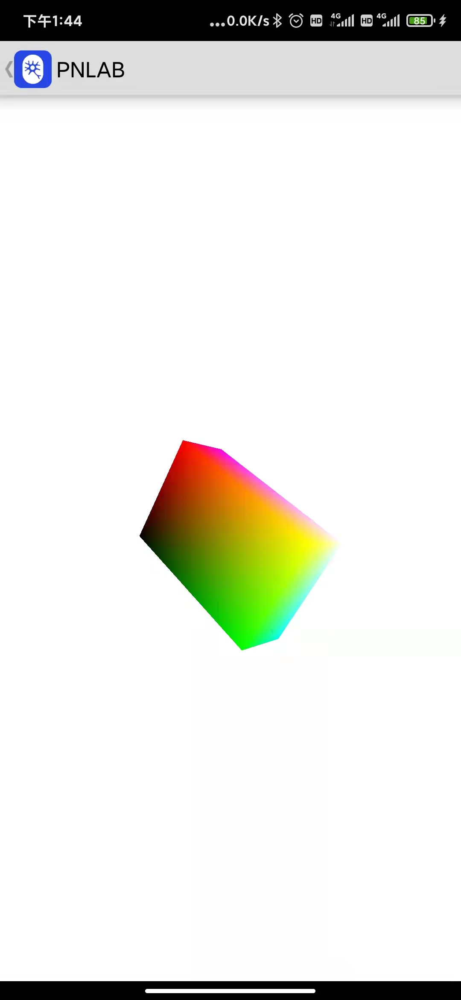

# 诺亦腾PN-Lab低功耗蓝牙传感器对接示例

本示例描述如何通过低功耗蓝牙（Bluetooth LE）协议连接PN-Lab惯性传感器Sensor的Android示例代码。包含两部分内容：

- Sensor的蓝牙连接和数据传输流程
- QAGM数据解析和长方体的3D展示

## 开源协议

本示例代码基于以下开源代码改造而成，属于Apache 2.0 License。

- Android低功耗蓝牙代码示例: [Android BluetoothLeGatt Sample](https://github.com/android/connectivity-samples/tree/main/BluetoothLeGatt)

> 关于低功耗蓝牙的一些基本概念和调用流程，请参考文档：https://developer.android.com/guide/topics/connectivity/bluetooth/ble-overview

- 立方体3D模型展示：[RotationVectorDemo](https://android.googlesource.com/platform/development/+/master/samples/ApiDemos/src/com/example/android/apis/os/RotationVectorDemo.java)

> 关于Android的OpenGL ES的使用，请参考文档：https://developer.android.com/guide/topics/graphics/opengl

## 环境要求

- Android SDK 28
- Android Build Tools v28.0.3

## 功能介绍

本示例代码里包含了三个界面（Activity）和一个服务（Service），以及其他一些工具类和数据类。

- DeviceScanActivity: 蓝牙设备列表页，也是入口Activity，扫描蓝牙设备（可以根据设备名称过滤），以列表展示。显示蓝牙设备mac地址，名称和bond状态。
- DeviceControlActivity：具体的一个蓝牙设备详情页，启动并绑定了BluetoothLeService服务，显示蓝牙设备的支持的服务列表（GATT service）以及每个GATT服务下的蓝牙特征列表（Characteristic）。点击每个Characteristic，弹框展示其属性（Properties），根据属性值，触发Read，Write和Notification指令。
- BluetoothLeService：Android标准服务，用于提供针对每个蓝牙设备的指令控制，例如：连接，断开，服务发现，读写Characteristic等。
- DeviceViewActivity：使用GLSurfaceView展示一个3D长方体，监听PN Sensor上报的姿态数据（四元数）驱动长方体的姿态变化。

- PnGattAttributes：数据类封装了PN蓝牙支持的Service UUID和Characteristic UUID
- Quaternion：四元数的封装类
- EulerAngles：欧拉角的封装类
- ImuQagm：数据类封装了sensor上报的QAGM数据。

> QAGM分别代表：Quaternion（四元数姿态数据），Accelerator（加速度数据），Gyro（重力计数据），Magnetic（磁力计数据）

### 界面展示
1. DeviceScanActivity

|      |      |
| ---- | ---- |
|  DeviceScanActivity    |  Filter by device name    |

2. DeviceControlActivity

|      |      |
| ---- | ---- |
|   DeviceControlActivity   |   Characteristic Detail Dialog   |

3. DeviceViewActivity

|      |
| ---- |
| Device View |

### 使用步骤

1. 首次安装完成后，需要到系统的应用信息的权限管理里，授权该应用的“定位”权限为“始终允许”
2. 启动应用，进入设备列表页（DeviceScanActivity），程序会自动扫描附近蓝牙设备，点击右上角“filter”按钮，输入设备名称进行过滤。匹配规则为：扫描的蓝牙设备名称包含filter字符串。
3. 点击蓝牙设备，进入设备详情页（DeviceControlActivity），右上角提供了“connect”和“disconnect”功能按钮，当设备连接成功后，自动开始服务发现，并以列表展示该蓝牙设备支持的服务。

> 注：首次连接PN蓝牙sensor时，需要进行配对，配对码为123456

4. 点击并展开“PNLAB Data Service"（UUID：00005A00-3846-5A8B-0000-F3A4C5D6E49F），可以看到该Service支持的Characteristic。

   1. IMU Data Trans（00005A01-3846-5A8B-0000-F3A4C5D6E49F）：Notify，byte数组，上报Sensor的数据，格式由IMU Data Mode数据决定。
   2. IMU Data Mode（00005A02-3846-5A8B-0000-F3A4C5D6E49F）：Read，UINT8，表示IMU Data Trans上报的数据格式。目前仅支持QAGM格式数据。具体的数据格式，请参见QAGM数据一节。
      - 0x00 - QAGM模式
   3. IMU Data Speed（00005A03-3846-5A8B-0000-F3A4C5D6E49F）：Read/Write，UNIT16（little endian），设置IMU Data Trans的数据上报频率。取值范围：1Hz-60Hz。默认是60

   > 具体的PN Sensor的蓝牙协议文档，请参见：TODO

5. 设置MTU：蓝牙设备连接成功后，DeviceControlActivity页面，点击右上角Menu的MTU子菜单，在对话框中输入50，点击确定

6. 触发IMU Data Trans的Notify：DeviceControlActivity页面，点击“PNLAB Data Service"下的“IMU Data Trans”，在对话框中，点击“notification”按钮，触发IMU Data Trans的数据上报，默认60Hz

7. 打开Sensor的3D模型页面：在DeviceControlActivity页面，点击右上角Menu的View子菜单，打开了3D模型页面。

## 设计文档

### 类图

### 流程图

- 蓝牙设备发现，连接，发现服务，设置Characteristic流程

## 数据格式

### QAGM数据

IMU Data Trans上报的QAGM数据，是28个字节，数据格式如下图：

> uint8：表示无符号byte，取值范围0~255
>
> int16：有符号的2byte，Little endian编码

- id: sensor的ID
- frame_no: 帧序号，0-255循环上报
- quarternion_w，quarternion_x, quarternion_y, quarternion_z：单位四元数的w,x,y,z。每个变量按照有符号Little endian编码转换后，除以32768，得到的浮点数为最终结果。值范围: -1.0 ~ 1.0
- accel_x, accel_y, accel_z：三轴的加速度计数据。每个变量按照有符号Little endian编码转换后，乘以0.244，得到的浮点数为最终结果。单位：mg
- gyro_x, gyro_y, gyro_z：三轴的陀螺仪数据。每个变量按照有符号Little endian编码转换后，乘以0.07，得到的浮点数为最终结果。单位：deg/s
- magn_x, magn_y, magn_z：三轴的磁力计数据。每个变量按照有符号Little endian编码转换后，乘以0.001，得到的浮点数为最终结果。值范围：-1.0 ~ 1.0

> 具体的数据转换参考实现，可以参考代码：ImuQagm.fromBytes(byte[] values)

### 坐标系

PN Sensor上报的四元数是右手坐标系，DeviceView页面显示的3D模型也是右手坐标系。

零位时，两者的坐标轴朝向如下图所示。

|  |   |
| ---- | ---- |
|Sensor坐标轴|屏幕坐标轴|

> 因为零位时，Sensor和手机屏幕的坐标轴朝向不一致，因此在DeviceView显示3D模型时，做了坐标轴的转换，代码详见：DeviceViewActivity类的handleData()方法

## Known Issues
1. 连接成功后，如果立刻开始RequestMTU，则会一定概率导致sensor死机，此问题正在分析和修复
2. 在数据上报时，如果调用disconnect，则会收到disconnected - connected - disconnected的三次回调，此问题正在分析中

## Q&A

### 第一个界面时，扫描不到蓝牙设备？

需要检查：

1. 程序的定位权限，需要设为“始终允许”
2. filter里的name字段，没有输错

### 连接上sensor后，打开IMU Data Trans的Notification后，没有数据接收？

需要确保每次连接成功后，都要设置MTU为50。

### 同时能够连接多少蓝牙设备？

不同手机实现方案不同，通常为7个。