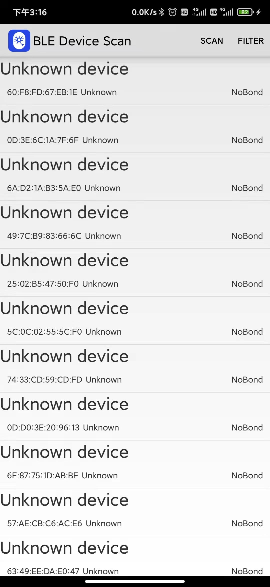
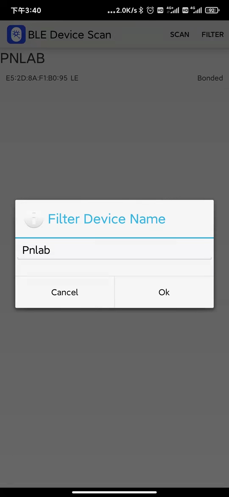
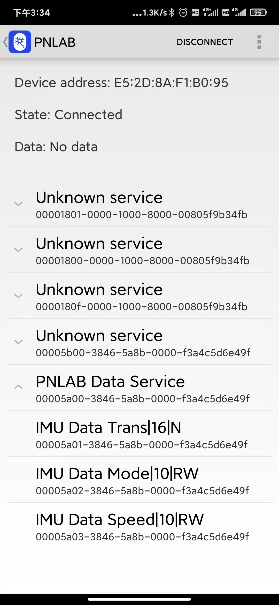
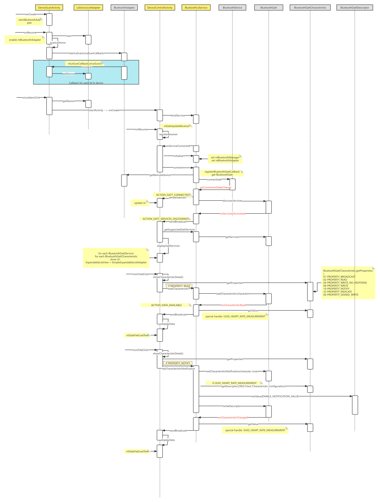

Noitom BluetoothPN Sample
===================================

This sample demonstrates how to use the Bluetooth LE Generic Attribute Profile (GATT)
to transmit data with Perception Neuron Sensor.

Introduction
------------

This sample shows a list of available Bluetooth LE devices and provides
an interface to connect, display data and display GATT services and
characteristics supported by the pn sensor.

It creates a [Service][1] for managing connection and data communication with a GATT server
hosted on a given Bluetooth LE device.

The Activities communicate with the Service, which in turn interacts with the [Bluetooth LE API][2].

[1]:http://developer.android.com/reference/android/app/Service.html
[2]:https://developer.android.com/reference/android/bluetooth/BluetoothGatt.html

Pre-requisites
--------------

- Android SDK 28
- Android Build Tools v28.0.3
- Android Support Repository

PNLab bluetooth spec
-----------------
todo: 

Activities
-------------

This sample has two activity:
- DeviceScanActivity: main launcher activity to scan bluetooth le devices and list them. User can filter the devices by device name.
- DeviceControlActivity: to show the bluetooth detail info as services, characteristics. This activity contains a dialog to show a characteristic detail info. In this dialog, user can read,write and switch notification to the characteristic.

Screenshots
-------------
1. DeviceScanActivity 

2. Filter by device name

3. DeviceControlActivity

4. Characteristic Detail Dialog

Use cases
------------------
- IMU Data Trans Data Notification
1. Find the PNLAB sensor in DeviceScanActivity and click it to open DeviceControlActivity
2. In DeviceControlActivity, click menu at top-right, select "MTU". input 50 in dialog and click ok. This is to request sensor to send data pack size at 50 bytes.
3. In DeviceControlActivity, expand service "PNLAB Data Service" to show characteristics list. click "IMU Data Trans"  to open characteristic detail dialog.
4. In  characteristic detail dialog, click "Notification" button. The data field will be updated repeatly at 60 fps.

Class Diagram
---------------

Sequence Diagram
-----------------

FAQ
-----------------
- No devices can be scanned?
make sure:
1. grant position permission to app in app info.
2. in filter dialog, make sure the device name is valid.

- fail to IMU Data Trans Data Notification

1. make sure:  set MTU to 50 in DeviceControlActivity.

